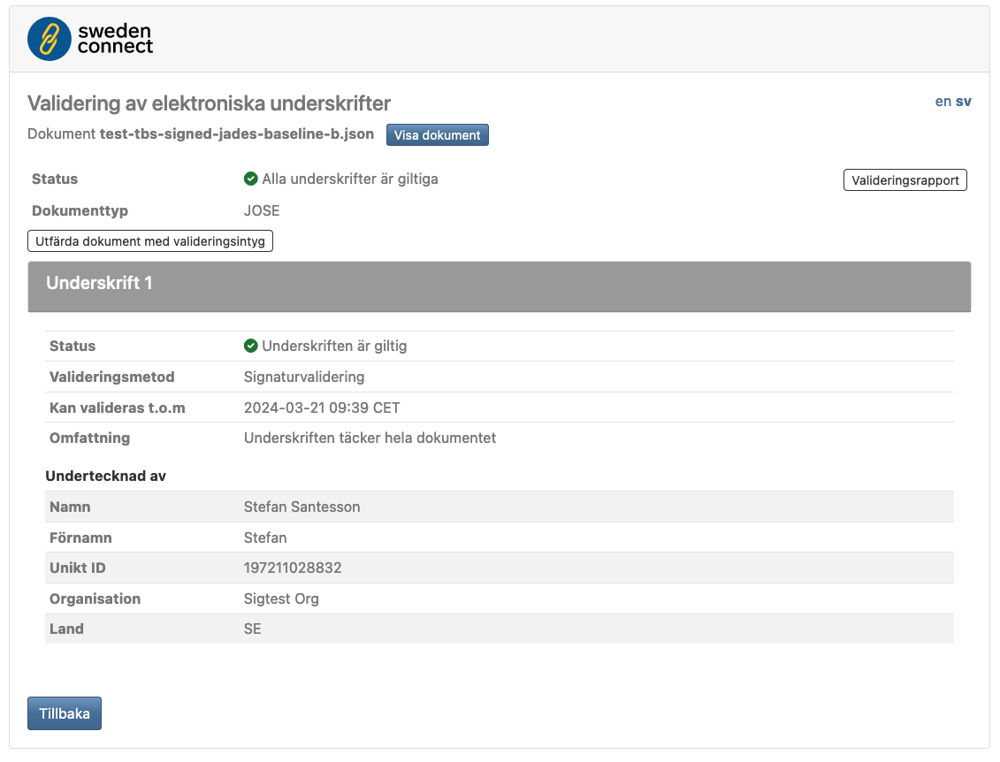
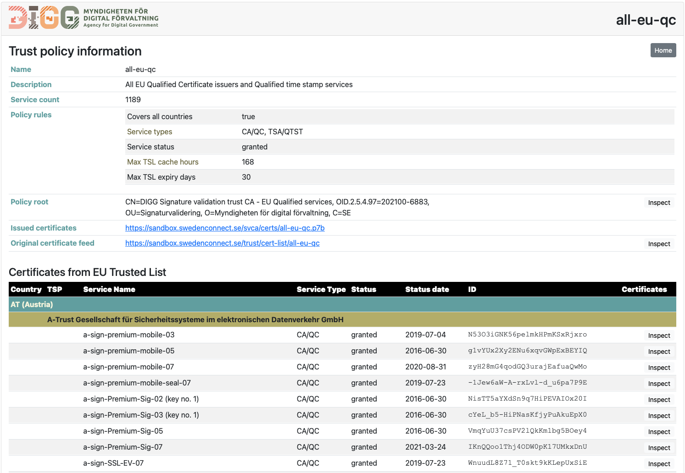

# sig-validation-service

---

This repository is a reference implementation that demonstrates usage of the Sweden Connect signature validation open source
implementations.

- [https://github.com/swedenconnect/signature-validation](https://github.com/swedenconnect/signature-validation)
- [https://github.com/swedenconnect/svt-core](https://github.com/swedenconnect/svt-core)

This reference implementation provides a Spring Boot web application for validation of signed documents:

The following main features are demonstrated:

- Validation of PDF, XML and JSON signed documents
- Manual upload of signed documents with a validation result UI
- Rest API for providing a document for validation using HTTP POST where the result is provided as a signature validation report according to ETSI TS 119 102-2.
- Issuance of "Signature Validation Token" (SVT) for validated signatures
- Enhancing signed documents by incorporating SVT into signed documents
- Validation of signed documents that has been enhanced with SVT.
- Rest API for requesting SVT enhanced signed document using HTTP POST

## Scope

The scope of this service is limited to demonstration of functionality. Its purpose is to help developers to implement their own service that supports their local validation procedures and trust policy.

## Trust configuration

This application further demonstrates use of the trust configuration service from DIGG (Swedish Agency for Digital Government) as source of trust:

This service provides a source of trusting EU service providers that can be found on Trusted Lists from EU member states. This service may also be used to add other services that are trusted by local policy.

The signature validation service implements a number of independent trust strategies:

- Using DIGG trust configuration service
- Specifying a local set of trusted certificate issuers, time-stamp issuers, and SVT issuers.

## Supported signature formats

This application supports validation of the following signature formats:

- XML DSig signed documents
- ETSI XAdES signed documents
- PDF signed documents
- ETSI PAdES signed documents
- JOSE signed documents (JSON signature)
- ETSI JAdES signed documents

## Archiving support

This service uses the open-source implementation of Signature Validation Tokens defined by RFC 9321 [https://datatracker.ietf.org/doc/rfc9321/](https://datatracker.ietf.org/doc/rfc9321/)

The SVT is a tool for preservation and archival of validation results. 
This means that the SVT is a simple format to store and archive a validation result as a result of a signature validation process. The signature validation result is bound to the signed document and the validated signature in a way that allows the signature validation result to be validated against the signed document into a distant future, allowing the signed document to be archived for a very long time where the signature validation result is preserved along with the signed document.

The SVT is a complementary technology to various solutions used to validate signatures, including complex solutions for validation of old signatures. Once the validation solution has been used to validate the signature, then that validation result can be preserved using SVT.

## REST API for signature validation and issuing SVT

### Signature validation REST API

This REST API allows an external service to upload a signed document (XML, PDF or JOSE) for validation and to obtain a full validation report for this document
according to ETSI TS 119 102-2

| Property     | value                                                                        |
|--------------|------------------------------------------------------------------------------|
| URL          | "`/report`" (e.g. `http://example.com/sigval/report`)                        |
| method       | POST                                                                         |
| data         | the bytes of the document to be validated (PDF, XML or JOSE signed document) |
| content-type | Any (Recommended to use the content-type of the uploaded document)           |
| returns      | XML document containing the ETSI TS 119 102-2 validation report              |

| query parameters | value                                                                                                                                                                                                 |
|------------------|-------------------------------------------------------------------------------------------------------------------------------------------------------------------------------------------------------|
| `certpath`       | Value `true` includes information about the full certificate path in the validation report. Default = `false` (only include signer certificate).                                                      |
| `include-docs`   | Value `true` includes the data signed by the signature (JSON, XML) or the version of the document before signing (PDF) in the report for each signature. Default = `false` (only include hash value). |

### SVT issuance REST API

This REST API allows an external service to upload a signed document (XML, PDF of JOSE) for validation and return the same document enhanced with an SVT
issued by this service.

| Property     | value                                                                        |
|--------------|------------------------------------------------------------------------------|
| URL          | "`/issue-svt`" (e.g. `http://example.com/sigval/issue-svt`)                  |
| method       | POST                                                                         |
| data         | the bytes of the document to be validated (PDF, XML or JOSE signed document) |
| content-type | Any (Recommended to use the content-type of the uploaded document)           |
| returns      | the uploaded document enhanced with an SVT (on success)                      |

| query parameters | value                                                                                                                                    |
|------------------|------------------------------------------------------------------------------------------------------------------------------------------|
| `name`           | The name of the document used when returning the svt enhanced signed document                                                            |
| `replace`        | Value `true` causes any existing SVT in the document to be replaced with a new SVT. Default = `false` (Add this SVT to any existing SVT) |

## Service credential configuration

Key configuration for keys used to issue SVT and validation reports supports the following types:

| Key type | Key source                                                                  |
|----------|-----------------------------------------------------------------------------|
| `jks`    | Keys stored in a Java key store file.                                       |
| `pkcs12` | Keys stored in a PKCS#12 key store file.                                    |
| `pkcs11` | The private key is stored in an external HSM device accessed using PKCS#11. |
| `pem`    | Private and public key are provided in separate PEM files.                  |
| `create` | Create a new key at every startup (for test only)                           |
| `none`   | no key                                                                      |

The details of the credential specified by key type are specified using the following property prefixes:

| Property prefix       | credential                                           |
|-----------------------|------------------------------------------------------|
| sigval-service.svt    | SVT issuance credential configuration                |
| sigval-service.report | Signature validation report credential configuration |

The following properties can be set:

| Property              | Definition                                                              |
|-----------------------|-------------------------------------------------------------------------|
| keySourceType         | Key type as specified above                                             |
| keySourceLocation     | Location of the key (empty for PKCS#11)                                 |
| keySourcePass         | Password/Pin for accessing the key                                      |
| keySourceAlias        | Key alias within the key source                                         |
| keySourceCertLocation | Certificate file location. Must be provided for `pkcs11` and `pem` only |

If any of the keys are of type `pkcs11` the following property must also be set:

> sigval-service.pkcs11.external-config-locations

The value of this property is the location of a PKCS11 provider configuration file (See Java documentation for content description).

## Demo deployment

A demo deployment of this service is available here: [https://sandbox.swedenconnect.se/sigval/](https://sandbox.swedenconnect.se/sigval/).

IMPORTANT NOTE: This service MUST NOT be used to validate signatures on real documents for production purposes. This service is configured to trust various test keys and identities and a positive validation result provided by this service is no statement of validity beyond the scope of testing the technology itself.

---

Copyright &copy; 2020-2022, [IDsec Solutions AB](http://www.idsec.se). Licensed under version 2.0 of the [Apache License](http://www.apache.org/licenses/LICENSE-2.0).
